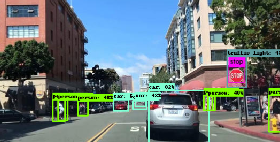

<table border="0" width="10%">
  <tr>
    <td></td>
    <td></td>
    <td></td>
  </tr>
  <tr>
    <td></td>
    <td></td>
    <td></td>
  </tr>
   <tr>
    <td></td>
    <td></td>
    <td></td>
  </tr>
</table>

# pytorch-faster-rcnn
##  1. Introduction  
Pytorch based implementation of faster rcnn framework.For details about faster R-CNN please refer to the paper [Faster R-CNN: Towards Real-Time Object Detection with Region Proposal Networks]((https://arxiv.org/abs/1506.01497)) by Shaoqing Ren, Kaiming He, Ross Girshick, Jian Sun


This detection framework has the following features:  
* It can be run as pure python code, and also pure based on pytorch framework, no need to build
* It is easily trained by only running a train.py script, just set the data root dir
* It has many backbone networks. like vgg, resnet-fpn, mobilenet, high resolution net(HRNet)
* It can be a really detection framework. You only need to change super parameters in config file and get different models to compare different model
* It's memory-efficient (about 3GB for vgg16)
##  2. Installation
### 2.1 Prerequisites
* Python 2.7 or 3.5  
* Pytorch 1.5.1  
* torchvision 0.6.1  
* numpy 1.15.4
* Pillow 6.1.0
* pycocotools 2.0
* matplotlib 3.0.2
* tensorboardX 2.0  
```Shell
pip install -r requirements.txt
  ```
### 2.2 Code-Preparing
 ```Shell
  git clone https://github.com/AlphaJia/pytorch-faster-rcnn.git
  ```
##  3. Data Preparation
### COCO  
##### 3.1 Download the training, validation, test data and annotations
```Shell
 wget http://images.cocodataset.org/zips/train2017.zip  
 wget http://images.cocodataset.org/zips/val2017.zip
 wget http://images.cocodataset.org/zips/test2017.zip
 wget http://images.cocodataset.org/annotations/annotations_trainval2017.zip
  ```
#####  3.2 Extract all of these tars into one directory named COCODevKit
```Shell
 tar xvf train2017.zip
 tar xvf val2017.zip
 tar xvf test2017.zip
 tar xvf annotations_trainval2017.zip
  ```
#####  3.3 Data dir should like this
 ```
    COCODevKit
        |-- train2017
                |-- [xxxxxxxxxxxx].jpg
        |-- val2017
                |-- [xxxxxxxxxxxx].jpg
        |-- test2017
                |-- [xxxxxxxxxxxx].jpg
        |-- annotations
                |-- instances_train2017.json
                |-- instances_val2017.json
                |-- image_info_test2017.json
   ```  
#####  3.4 modify data_root_dir cfg item in config/train_config.py with /path/COCODevKit/ 

##  4. Train
Modify model_save_dir cfg item in config/train_config.py with your own save path and device_name with your own device
* Train with [mobilenet]((https://arxiv.org/abs/1801.04381))  
Modify backbone cfg item in config/train_config.py with mobilenet, download pretrained weights [here](https://download.pytorch.org/models/mobilenet_v2-b0353104.pth), and set backbone_pretrained_weights in config/train_config.py with downloaded path.
```Shell
 python train.py
  ```
* 4.2 Train with [resnet-fpn]((https://arxiv.org/abs/1409.1556))  
Modify backbone cfg item in config/train_config.py with resnet50_fpn, download pretrained weights [here](https://download.pytorch.org/models/fasterrcnn_resnet50_fpn_coco-258fb6c6.pth), and set backbone_pretrained_weights in config/train_config.py with downloaded path
```Shell
 python train.py
  ```
* 4.3 Train with [vgg16]((https://arxiv.org/abs/1409.1556))  
Modify backbone cfg item in config/train_config.py with vgg16
```Shell
 python train.py
  ```
* 4.4 Train with [HRNet]((https://arxiv.org/abs/1409.1556))  
Modify backbone cfg item in config/train_config.py with HRNe
```Shell
 python train.py
  ```

Weights and tensorboard log will save in your model_save_path dir  
you may refer to config/train_config.py for more argument.  
Some Key arguments:  
`--backbone`: feature extraction backbone network  
`--backbone_pretrained_weights`: backbone pretrained weights, None or path  
`--train_horizon_flip_prob`: data horizontal flip probability  
`--num_class`: number of classification, including background  
`--data_root_dir`: COCO dataset root dir  
`--model_save_dir`: training weights save path  
`--device_name`: training device   
`--num_epochs`: training epochs   
##  5. Test  
Modify model_weights cfg item in config/train_config.py with your trained weights path and gpu_id with your own cuda device ID.  
you may refer to config/test_config.py for more argument.  
Some Key arguments:  
`--model_weights`: training save path  
`--image_path`: predicted images  
`--gpu_id`: cuda device gpu ID  
`--num_classes`: number of classification, including background  
`--data_root_dir`: COCO dataset root dir  

```Shell
 python test.py
  ```
##  6. Demo  
  
##  7. Framework Structure  
#### backbone
This module includes backbone feature extraction network    
* vgg16:vgg16 net network([Very Deep Convolutional Networks for Large-Scale Image Recognition](https://arxiv.org/abs/1409.1556))
* fpn101:resnet101 fpn network([Deep Residual Learning for Image Recognition](https://arxiv.org/abs/1512.03385)) ([Feature Pyramid Networks for Object Detection](https://arxiv.org/abs/1612.03144))
* hrnet:high resolution net([Deep High-Resolution Representation Learning for Visual Recognition](https://arxiv.org/abs/1908.07919))
* mobile_net:mobile_net v2 network([MobileNetV2: Inverted Residuals and Linear Bottlenecks](https://arxiv.org/abs/1801.04381))
#### config
This module includes config parameters in training period  and testing period
* test_config: specify config parameters in testing period like model_file, image_path_dir, save_dir, etc.
* train_config: specify config parameters in training period like backbone network, batch_size, image_path_dir, anchor_size, ect.
#### dataloader
This module inherits pytorch dataloader classes, dataset IO.You can also generate your own dataset dataloader IO and put it in this module
* coco_dataset: coco([Common Objects in Context](https://cocodataset.org/#home)) dataset dataloader IO
#### test
This module includes the utils function test(common called unit test, also called UT)
* anchor_utils_test: some unit testing for utils/anchor_utils.py
#### utils
This module includes some utilies for image processing, network architectures building, anchor generating, loss function, etc.
* anchor_utils: some basic function for building anchors
* im_utils: some basic function for image processing

# Continue Updating
